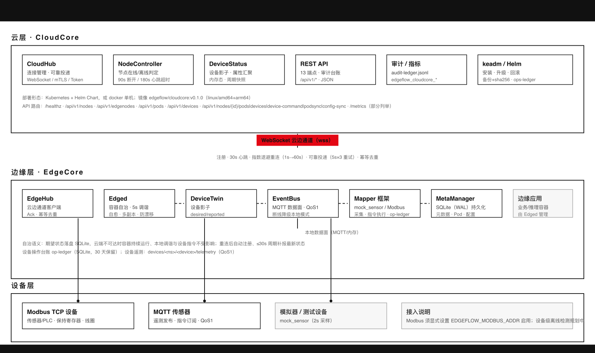
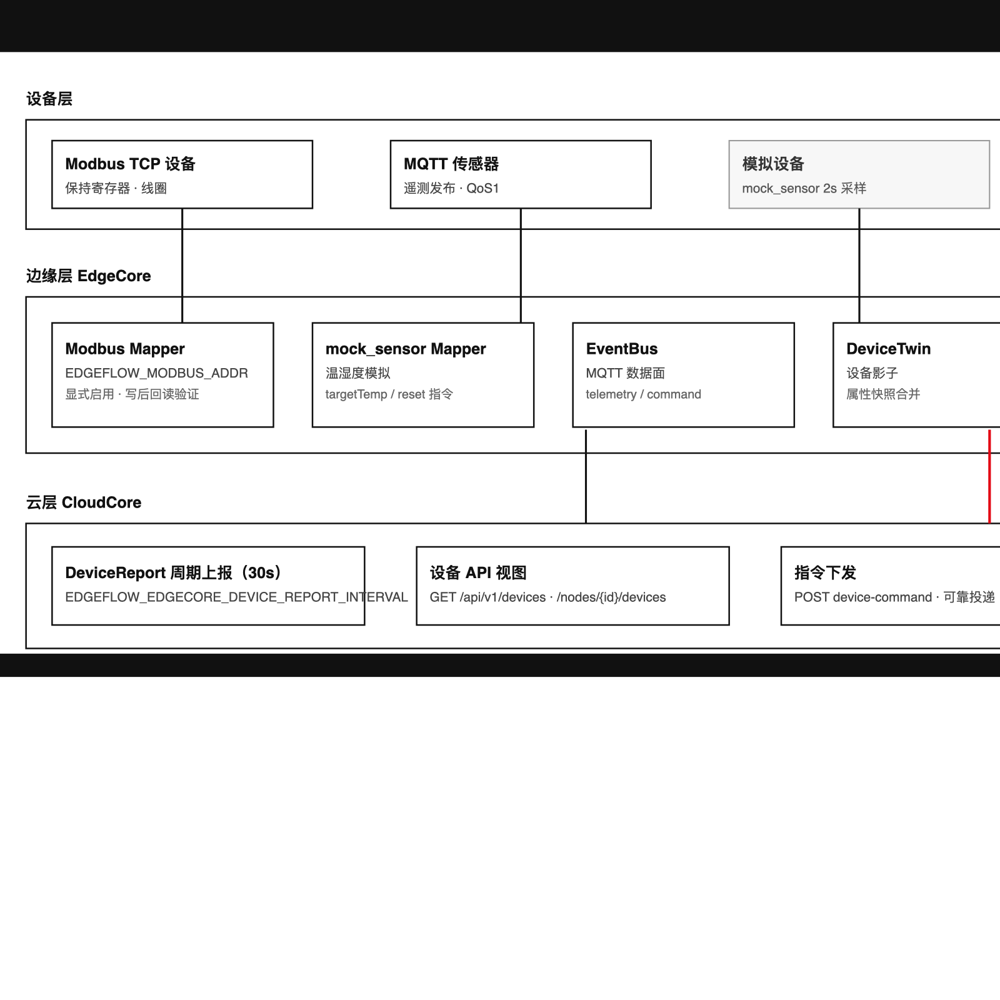
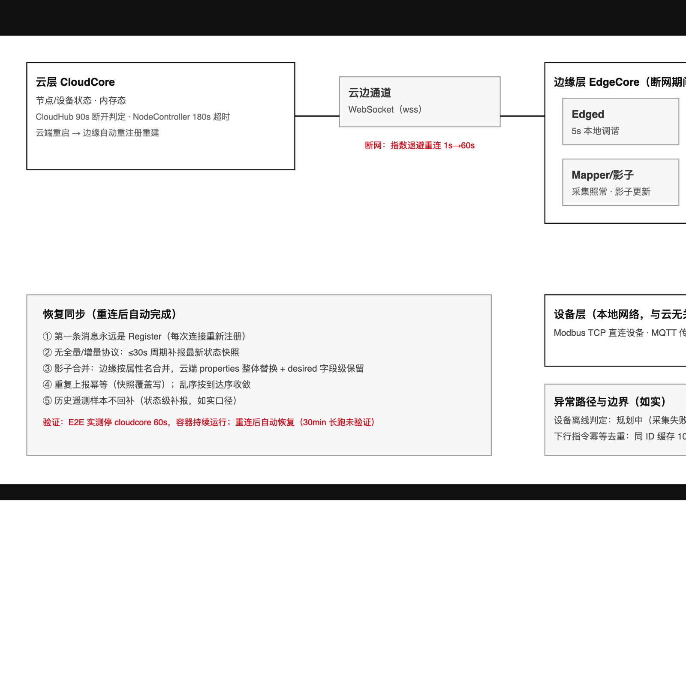
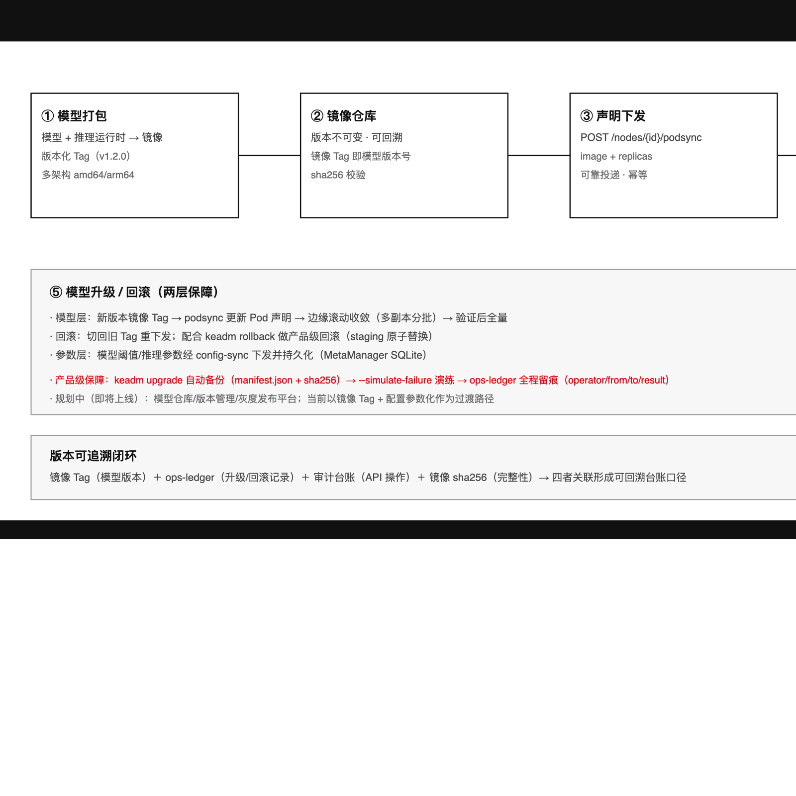
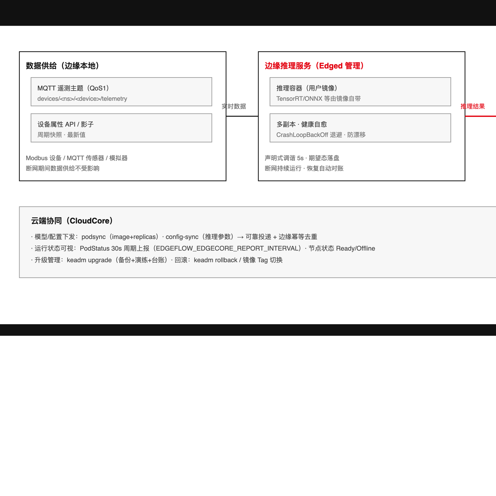
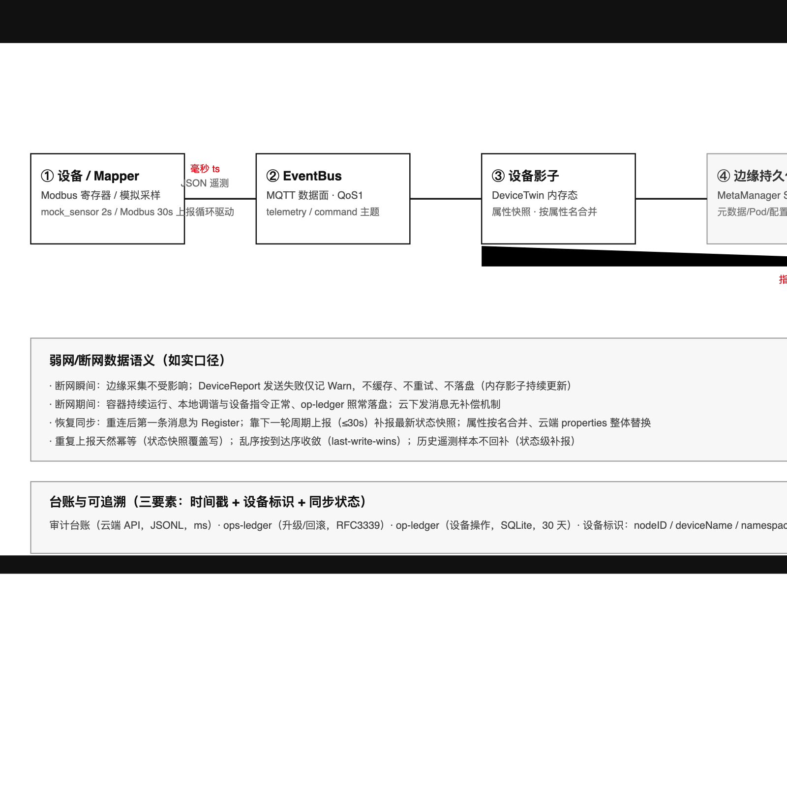

# EdgeFlow 物联网解决方案手册

**四场景：物联网数据采集 · 弱网自治 · 模型管理 · 模型应用**

| 项 | 内容 |
|---|---|
| 产品版本基线 | EdgeFlow v0.1.0（2026-08-14 发布） |
| 手册版本 | v1.0.2 |
| 密级 | 公开（售前/客户技术交流） |
| 适用范围 | 售前方案设计、客户技术决策、PoC 部署参考 |

> **声明**：本手册所有能力、参数与数字均以 EdgeFlow v0.1.0（2026-08-14 发布；v1.0.1 勘误补充 2026-08-16 收尾补强能力入册，v1.0.2 补充 2026-08-18 v0.1.1 发布轮安全加固入册，详见修订记录）已核验实现为准；规划中/尚未实现的能力一律明确标注"规划中/即将上线"，不构成交付承诺。文中命令与字段均为示意用法，具体语法以产品文档为准。

## 修订记录

| 版本 | 日期 | 修订人 | 说明 |
|---|---|---|---|
| v1.0.2 | 2026-08-18 | 技术团队 | v0.1.1 发布轮安全加固入册：/ocsp per-IP 限流（默认 10 req/s、超限 429）+ Cache-Control、OCSP 客户端新鲜度校验 API（fail-closed）、CRL 锁降级日志；P2 代码审查遗留闭环 |
| v1.0.1 | 2026-08-16 | 技术团队 | 补强入册：证书吊销闭环（CRL+OCSP）、配置热重载与 edgecore 配置文件、gzip 通道压缩、keadm cert/batch、端点 13→14、OpenAPI/契约测试；口径修正（F42/F44/F47/F48 拆分） |
| v1.0.0 | 2026-08-14 | 方案与产品团队 | 首版定稿：四场景 × 五部分结构、数据链路与台账口径、特性-场景映射表 |

---

# 第 1 章 方案总览

## 1.1 产品定位与价值主张

**EdgeFlow 是什么**

EdgeFlow 是使用 Go 语言实现的云边端协同物联网平台，覆盖设备接入、边缘计算与云端统一管控场景，由云端与边缘两层软件栈构成：

- **云端 CloudCore**：承担统一管控、REST API、审计台账与运行指标；
- **边缘 EdgeCore**：由 EdgeHub（云边通道）、Edged（容器自治）、DeviceTwin（设备影子）、EventBus（MQTT 数据面）、Mapper（设备接入）、MetaManager（SQLite 持久化）六个组件协同工作。

**解决什么问题**

1. **设备接入与数据汇聚的标准化**：支持 MQTT、Modbus TCP 两类主流协议接入，遥测数据以统一 JSON 格式进入边缘 MQTT 数据面，屏蔽设备异构性（OPC-UA 接入规划中/即将上线）；
2. **边缘应用自治与弱网韧性**：以声明式调谐（默认 5s 调谐周期）持续将容器应用收敛到期望状态，支持多副本、健康自愈、CrashLoopBackOff 退避与镜像漂移检测，云边断连期间边缘采集与控制业务不中断；
3. **管理与运维的可追溯性**：审计台账、keadm 升级回滚台账、设备操作台账三类台账覆盖 API 操作、系统变更与设备指令全链路，支撑审计与合规追溯；
4. **生产级安全与轻量交付**：mTLS 云边通道（握手按 CRL 拒绝吊销证书）、接入 Token、证书生命周期管理（keadm cert rotate 轮换 / cert revoke 吊销，CRL 离线 + OCSP 在线双通道）、审计台账（文件 0600/目录 0700），keadm/Helm 一键部署，多架构镜像（linux/amd64 + arm64）。

**价值主张**（结果性描述，不承诺 SLA 与收益数字）

- **边缘自治**：应用期望状态由云端统一下发，边缘按声明持续调谐，减少现场人工干预；
- **弱网可用**：云边通道断开不中断边缘采集与设备控制，网络恢复后自动重连并周期补报最新状态；
- **全程可溯**：从 API 调用、系统升级到单条设备指令，均留有带时间戳与设备标识的台账记录；
- **快速落地**：keadm 初始化云端/接入边缘、Helm 部署云端、Docker 运行双端镜像，降低交付门槛。

## 1.2 整体架构



EdgeFlow 采用"设备层—边缘层—云层"三层架构，文字版说明如下：

**设备层**：包括 Modbus TCP 设备、MQTT 传感器，以及用于演示与联调的模拟器 mock_sensor（内存波动模拟遥测，2s 周期）。

**边缘层（EdgeCore）**，六个组件协作：

- **Mapper**：设备接入与采集。Modbus 读保持寄存器（由 30s 上报循环驱动），采集结果写入 EventBus；
- **EventBus**：边缘 MQTT 数据面，承载遥测/指令主题，是 Mapper 与 DeviceTwin 之间的数据通道（QoS1）；
- **DeviceTwin**：设备影子，维护设备属性最新快照（内存态），并向云端周期上报；
- **MetaManager**：以 SQLite（WAL 模式）落盘节点元数据、Pod 期望状态与配置，提供边缘持久化；
- **Edged**：容器应用管理，按声明式调谐维护容器运行状态；
- **EdgeHub**：云边通信组件，通过 WebSocket 与云端 CloudHub 建立双向通道（支持退避重连）。

**云层（CloudCore）**，可部署于 Kubernetes（Helm Chart）或 Docker：

- **CloudHub**：边缘节点连接管理；
- **NodeController**：节点状态维护；
- **DeviceStatus**：设备状态快照维护（内存态）；
- **REST API**：对外提供 14 个 HTTP 端点（11 个管理端点 + healthz + metrics + /ocsp 协议端点；管理端点：设备、节点、命令、podsync/config-sync 等）；
- **OCSP responder**：在线证书状态查询（POST /ocsp，RFC 6960；DER 编码请求/响应、免 Token——响应自带 CA 签名、16KiB 请求上限，状态码 200/400/429/500；per-IP 限流（默认 10 req/s、burst 20，超限 429，env 可调）+ 成功响应 Cache-Control: max-age=3600；与 CRL 同源 crl.json）；
- **审计与指标**：JSONL 审计台账 + 5 项运行指标。

## 1.3 核心能力地图

**表 1-1：四场景 × 特性组能力对照（v0.1.0 已实现 vs 规划中）**

| 场景 | 特性组 | v0.1.0 已实现 | 规划中/即将上线 |
|---|---|---|---|
| 数据采集 | F21–F30 | MQTT/Modbus 设备接入；Mapper 周期采集（Modbus 30s 上报循环 / mock_sensor 2s）；EventBus MQTT 数据面（QoS1）；设备影子与属性快照；设备命令下行（可靠投递 F05）；DeviceReport 周期上报（30s，可配） | OPC-UA 协议接入；设备级身份认证（节点接入 Token 认证已实现） |
| 弱网自治 | F11–F20 | WebSocket 云边通道（gzip 协商式压缩）与退避重连；声明式调谐（5s）；多副本；健康自愈；CrashLoopBackOff；镜像漂移检测；MetaManager SQLite（WAL）持久化 | Flannel 网络；Protobuf 编码（gzip 通道压缩已实现） |
| 模型管理 | F36–F39 | 镜像/配置下发通道（podsync/config-sync）；生产部署与升级回滚机制（升级分批灰度已工具化，见 4.2/4.4） | 模型仓库与版本管理；模型灰度发布（按节点/按比例） |
| 模型应用 | F11–F19 | 容器应用部署与自治：多副本、健康自愈、CrashLoopBackOff、镜像漂移检测 | 模型灰度发布；调度/超卖 |

> 注：特性编号沿用产品特性基线；同一编号区间在不同场景视图下以该场景语义为准。

## 1.4 版本与发布信息

**版本信息**：EdgeFlow v0.1.0，发布日期 2026-08-14。

**制品清单（表 1-2）**

| 类别 | 制品 |
|---|---|
| 容器镜像 | edgeflow/cloudcore:v0.1.0、edgeflow/edgecore:v0.1.0（linux/amd64 + arm64 多架构） |
| 部署工具 | keadm（init/join/cert(rotate|revoke)/upgrade/rollback/ops-ledger/batch/reset/version，共 9 个子命令）、Helm Chart（云端）、Docker（双端运行） |
| 接口能力 | REST API 14 端点（11 管理 + healthz + metrics + /ocsp）；运行指标 5 项；OpenAPI v3 schema（docs/openapi/edgeflow-openapi.yaml，hack/gen-openapi.sh 自动生成，勿手编）；API 兼容性契约测试（tests/contract，14 端点） |

**v0.1.0 功能范围（已实现）**：WebSocket 云边通道（Register 协商式 gzip 通道压缩，v1.0 兼容，config/cloudcore.json compress:false 可关）；边缘容器自治（声明式调谐 5s、多副本、健康自愈、CrashLoopBackOff、镜像漂移检测）；设备管理（MQTT/Modbus 接入、设备影子、设备命令）；节点接入认证（Register Token：keadm join 写入 EDGEFLOW_EDGECORE_TOKEN，云端常数时间校验、空值向后兼容）；生产加固（mTLS 云边通道按 CRL 拒绝吊销证书、证书生命周期管理（keadm cert rotate 轮换 / cert revoke 吊销，CRL 离线吊销 + OCSP 在线应答）、审计台账/keadm/Helm/多架构镜像）；配置管理（edgecore 配置文件 config/edgecore.json，优先级 env > 文件 > 默认；SIGHUP + 60s 轮询热重载）；升级回滚与灰度（keadm upgrade/rollback、升级分批灰度 keadm batch --op=upgrade + --batch-size/--pause-between）；接口工程（OpenAPI v3 schema、API 兼容性契约测试）。

**规划中/即将上线**：模型仓库与版本管理、模型灰度发布（升级分批灰度已工具化）、完整 RBAC（当前为单 Token 鉴权）、设备级身份认证（节点接入认证已实现）、调度/超卖、Flannel 网络、OPC-UA 接入、Protobuf 编码（gzip 通道压缩已实现）、产品内置镜像安全扫描（发布流程构建期 Trivy 扫描已建立，基线 0 漏洞）。

---

# 第 2 章 物联网数据采集场景

工业与园区场景中，数据采集是数字化底座的第一公里。本章基于 EdgeFlow v0.1.0 已实现能力，阐述以边缘就近采集为核心的方案设计、特性引用、部署方式与客户价值。

## 2.1 业务痛点

以下痛点基于工业/园区场景的通用行业实践（不涉及具体客户）：

- **设备协议异构，接入成本高**：工厂与园区内传感器、PLC、仪表、控制器等设备品牌繁杂，通信协议各异（Modbus、私有协议等）。每接入一类设备往往需要一套定制集成，重复建设、周期长，形成数据孤岛。
- **采集链路脆弱，单点依赖公网**：传统架构下设备数据经边缘逐级上送云端，任一环节（公网波动、云端故障）都会导致采集中断，现场业务"断网即停"。
- **全量上云，成本与时效失衡**：原始数据全量上云带来带宽与存储成本，而大量状态类数据只需周期性快照；高频采集与有限带宽之间存在矛盾。
- **运维黑盒，问题定位困难**：设备状态、指令执行结果、采集错误缺乏统一记录，现场排查依赖人工，故障不可追溯。

## 2.2 方案设计

EdgeFlow 采用"**边缘就近采集、数据面与管理面分离、影子汇聚、周期上报**"的架构：

- **边缘就近采集（本地优先）**：edgecore 部署于边缘节点，通过 Mapper 适配层对接现场设备。Modbus TCP 设备经本地网络直连（F26），采集链路不依赖公网，断云不影响采集；MQTT 数据面独立于云边管理面。
- **Mapper 适配层**：以 DeviceMapper 接口 + MapperRegistry 路由/生命周期管理（F24）实现协议适配；内置温湿度模拟 Mapper（F25）与 Modbus TCP Mapper（F26），新增协议以 Mapper 方式扩展。
- **MQTT 数据面**：EventBus 以 MQTT 承载遥测/指令主题，QoS1 至少一次投递（F28），消费方需自行幂等；broker 不可用时自动降级纯本地模式、进程不退出（F29）。
- **影子汇聚**：DeviceTwin 影子自动创建，合并 desired/reported（F21），边缘影子始终为最新值；设备属性按周期上报云端（F22），云端视图由上报构建（设备状态为云端内存态）。
- **指令闭环**：device-command 经可靠投递到达 Mapper 直接执行，并写回 Desired（F23），指令执行链路可追踪。

## 2.3 产品特性引用

| 场景需求 | 特性 | 能力说明 | 部署要点 |
|---|---|---|---|
| 协议异构设备统一接入 | F24 | DeviceMapper 接口 + MapperRegistry 负责 Mapper 的路由与生命周期 | 按协议实现 Mapper 并在 edgecore 启动时挂载 |
| 温湿度类设备接入与演示 | F25 | mock_sensor 模拟温湿度，2s 波动；支持 targetTemp/reset 指令，收敛+随机扰动 | 联调/演示开箱即用，无需实体设备 |
| Modbus 设备接入 | F26 | Modbus TCP Mapper：读写保持寄存器/线圈，写后回读验证，错误落 op-ledger | 显式 opt-in：须设置 EDGEFLOW_MODBUS_ADDR 才注册 |
| 遥测与指令数据面 | F28 | MQTT 遥测/指令主题，QoS1（至少一次、不保证去重，消费方需幂等）；paho 自动重连+订阅恢复 | 配置 MQTT broker；数据面独立于云边管理面 |
| 数据面容错 | F29 | broker 不可用自动降级纯本地模式，进程不退出 | 降级后恢复需重启 edgecore |
| 设备影子 | F21 | desired/reported 合并、深拷贝、自动创建 | 无需预建，首次上报自动创建 |
| 属性周期上报 | F22 | 默认 30s 上报一轮，启动即报 | 可用 EDGEFLOW_EDGECORE_DEVICE_REPORT_INTERVAL 调整（1s–10min） |
| 操作台账 | F27 | op-ledger 设备操作流水（SQLite 追加，30 天保留）：采集/下发方向、结果与错误 | 采集与指令操作自动落台账，Modbus 错误 result=error |
| 指令可靠闭环 | F23 | POST /api/v1/nodes/{nodeID}/device-command：可靠投递（5s 超时、最多 3 次尝试、同 ID 重发、幂等去重）→ Mapper 直接执行 → 写 Desired | 依赖云边通道可靠投递（F01/F05）承载 |
| 设备视图查询 | F30 | GET /api/v1/devices、GET /api/v1/nodes/{nodeID}/devices | 用于验证设备接入与属性可见性 |

> 注：本表收录 F21–F30 中经事实基线核验的条目；F01/F05 为指令链路所依赖的云边通道能力。

**边界说明（如实口径）**：

- 设备级离线检测**规划中**：当前无设备离线判定机制；Mapper 采集失败仅记 Warn，本轮按旧值上报；Modbus 读写错误落 op-ledger（result=error），需结合台账/日志人工定位。
- 云端设备状态为内存态，重启后依赖边缘周期上报重建（详见第 3 章）。

## 2.4 部署方式



以"边缘节点 + Modbus 设备（或 mock_sensor 模拟）"为例：

1. **部署 edgecore**：在边缘节点安装并启动 edgecore，确保与现场设备处于同一本地网络。
2. **启用 Mapper**：
   - 联调环境可直接使用 mock_sensor（F25），开箱即得温湿度数据与 targetTemp/reset 指令；
   - 接入真实 Modbus 设备时，设置环境变量 `EDGEFLOW_MODBUS_ADDR` 显式启用 Modbus TCP Mapper（F26，不设置则不注册）。
3. **配置 MQTT 数据面**：配置 MQTT broker（遥测/指令主题，QoS1，F28）。broker 不可用时 edgecore 自动降级纯本地模式继续运行（F29）；恢复后需重启 edgecore。
4. **配置上报周期**（可选）：设置 `EDGEFLOW_EDGECORE_DEVICE_REPORT_INTERVAL`（1s–10min，默认 30s；启动即报一轮，F22），或写入 edgecore 配置文件 `config/edgecore.json`（cloudAddr/podReportInterval/deviceReportInterval/reconcileInterval 4 字段，`--config` 可指定路径；优先级：环境变量 > 配置文件 > 默认值，敏感配置如 Token 仅走环境变量）。上报周期变更支持**热重载**（SIGHUP 立即重载或 ≤60s 自动检测生效，无需重启；重载失败保持旧配置继续运行，fail-safe），详见 3.4。
5. **验证**：
   - `GET /api/v1/devices` 查看设备与属性（影子数据，F30）；
   - `GET /api/v1/nodes/{nodeID}/devices` 按节点查看设备（F30）；
   - `POST /api/v1/nodes/{nodeID}/device-command` 下发指令（如 mock_sensor 的 targetTemp），验证可靠投递（5s×3 同 ID 重发、幂等去重）、Mapper 直接执行与 Desired 写回（F23）；
   - 对 Modbus 设备执行写操作后回读验证，错误可在 op-ledger 中查看（F26）。

## 2.5 客户价值

- **异构设备统一接入**：多协议设备经 Mapper 适配层统一接入，新增设备类型以 Mapper 方式扩展，减少重复集成。
- **采集与上云解耦**：本地优先采集不依赖公网，数据面与管理面分离，断云不影响现场采集。
- **指令可靠闭环**：指令下发具备重试与幂等去重，Mapper 直接执行并写回 Desired，执行链路完整可追踪。
- **操作可追溯**：指令执行与 Modbus 读写结果（含错误）落 op-ledger，为运维排查提供依据。

---

# 第 3 章 弱网自治场景

弱网自治是 EdgeFlow 面向矿区、海上平台、偏远园区等网络不稳定环境的核心理念：**断网业务不中断、恢复后自动对账**。本章描述三层自治设计、特性引用、参数调优与验证演练。

## 3.1 业务痛点

- **断网业务中断**：依赖云端协同的采集与控制业务在断网时停摆，现场生产受影响。
- **恢复后状态不一致**：断网期间边缘持续运行产生状态漂移，恢复后云端与边缘不一致，需人工对账。
- **命令丢失**：弱网抖动造成下行指令丢失或重复，设备状态不可预期。
- **运维被动**：节点离线发现滞后，恢复依赖人工干预，长周期弱网场景缺乏保障手段。

## 3.2 方案设计

三层自治设计：

**业务自治——容器持续运行与自愈。** 断网期间 Pod 容器持续运行：Edged 以 5s 周期本地调谐（F11），期望态持久化于 SQLite（F17）；本地设备指令（MQTT command 主题）照常下发；影子持续更新，op-ledger 照常落 SQLite；Pod/Config 期望态边缘持久，不依赖云端补发。

**数据自治——状态快照 + 周期补报（如实口径）。** 断网期间采集完全不受影响（2s 采样循环与网络无关，Modbus 本地直连照常）；DeviceReport 发送失败仅记 Warn，不缓存、不重试、不落盘，内存影子持续更新。恢复后无全量/增量同步协议，靠下一轮周期上报（≤30s）补报**最新状态快照**——即"状态级断点续传"，**不支持历史遥测样本回补**（断网期间样本不落盘）。业务需要历史留存时，应在 EventBus 侧或应用侧自行订阅持久化。

**通道自治——退避重连 + 可靠投递 + 幂等。** 云边通道断线后指数退避重连（1s 起步、翻倍、封顶 60s，注册成功重置，F04）；下发消息可靠投递（pending+Ack、同 ID 重发、最多 3 次尝试、超时 504，F05）；边缘侧幂等去重（同 ID 缓存 1000 条 FIFO，F05），重发不重复执行；重连后第一条消息永远是 Register（每次连接重新注册，F02），随后周期上报自动重建云端视图。

## 3.3 产品特性引用

| 弱网环节 | 特性 | 能力说明 | 弱网价值 |
|---|---|---|---|
| 云边通道 | F01 | WebSocket 云边管理面通道（TLS 开启自动升级 wss） | 一条连接承载全部控制与状态消息 |
| 节点注册 | F02 | 连接建立后首条消息 Register，RegisterAck 超时 10s | 重连即重新注册，身份自动恢复 |
| 心跳保活 | F03 | 30s 周期心跳 | 通道活性探测，支撑离线判定 |
| 退避重连 | F04 | 断线后 1s 起步翻倍、封顶 60s、注册成功重置 | 避免重连风暴，弱网抖动自动恢复 |
| 可靠投递 | F05 | pending+Ack、同 ID 重试 5s×3、幂等去重 1000 条、超时 504 | 下发指令不丢不重，弱网可靠闭环 |
| 节点在线/离线判定 | F07 | CloudHub 90s 断开 + NodeController 180s 心跳停滞（扫描 30s）双路径 | 离线判定不悬挂，状态最终收敛 |
| 节点状态语义 | F08 | Ready/Unknown/Offline 三态 | 状态标准化，与 K8s 语义对齐 |
| 云端状态自愈 | F09 | 云端内存态，边缘重连自动重注册恢复 | 云端重启无需人工恢复 |
| 声明式调谐 | F11 | 5s 周期本地对账，期望态在 SQLite | 断网期间容器持续收敛，业务不中断 |
| 多副本 | F12 | replicas 补齐/收缩 | 单副本异常自动补齐 |
| 健康自愈 | F13 | Inspect 非 Running 自动重启 | 容器异常自动恢复，无需人工 |
| CrashLoopBackOff | F14 | 3 次阈值/30s 退避/60s 稳定重置 | 崩溃循环自动退避，保护节点资源 |
| 镜像漂移检测 | F15 | 期望镜像比对、漂移重建（批 1 滚动） | 镜像被篡改自动还原，防漂移 |
| 断网自治 | F16 | 云端不可达容器持续运行，恢复自动同步 | 断网业务不中断（E2E 60s 实测） |
| MetaManager 持久化 | F17 | SQLite（WAL）落盘元数据/Pod/配置 | 期望态不丢，重启按声明收敛 |
| PodStatus 上报 | F18 | 30s 周期（可配 1s–10min），Absent 终态保留 90s | 云端实时掌握 Pod 运行状态 |
| 增量订阅通知 | F20 | MetaManager 本地变更订阅通知 | 边缘模块解耦联动 |

## 3.4 部署方式



**弱网参数调优（env）**：

| 参数 | 默认 | 说明 |
|---|---|---|
| 云边心跳周期 | 30s | 通道活性探测间隔（F03） |
| 退避重连上限 | 60s | 断线重连指数退避封顶（F04） |
| EDGEFLOW_EDGECORE_DEVICE_REPORT_INTERVAL | 30s（1s–10min） | 设备状态上报周期，弱网可调大降低流量（F22）；**支持热重载** |
| EDGEFLOW_EDGECORE_REPORT_INTERVAL | 30s（1s–10min） | Pod 状态上报周期（F18）；**支持热重载** |
| EDGEFLOW_CLOUDCORE_NODE_SCAN_INTERVAL / NODE_TIMEOUT | 30s / 180s | 节点心跳扫描周期与超时（F07） |

**配置方式与热重载**：除环境变量外，边缘参数可写入 edgecore 配置文件 `config/edgecore.json`（cloudAddr/podReportInterval/deviceReportInterval/reconcileInterval 4 字段，`--config` 指定路径；优先级：环境变量 > 配置文件 > 默认值，敏感配置仅走环境变量）。配置变更支持热重载：`SIGHUP` 立即重载 + 每 60s 自动检测文件变更；重载失败保持旧配置继续运行（fail-safe）。

**热生效边界**：

| 组件 | 配置项 | 生效方式 |
|---|---|---|
| cloudcore | port（HTTP 监听端口） | 热切换（新端口先监听成功再切换；绑定失败拒绝重载、旧监听保持） |
| cloudcore | hubPort（CloudHub WS 端口）、compress（gzip 压缩开关） | 需重启生效 |
| edgecore | podReportInterval / deviceReportInterval（上报周期） | 热生效（下一轮上报周期生效，无需重启） |
| edgecore | cloudAddr / nodeID / reconcileInterval | 需重启生效 |

**验证演练（参考 E2E 实测）**：

1. 正常接入 1 个边缘节点与 1 个业务容器，确认云端可见 Running；
2. 停止 cloudcore（模拟断网），观察 60s：边缘容器持续运行、本地设备指令照常下发、op-ledger 正常落盘（E2E 60s 短时验证已实测通过；30min 长跑未验证）；
3. 重启 cloudcore，观察：边缘感知断线（读超时约 90s）→ 退避重连 → 自动重新注册 → ≤30s 周期上报 → 云端节点/Pod/设备状态自动重建；
4. 断网期间下发设备指令，恢复后验证：指令经可靠投递重发到达且不重复执行（同 ID 幂等去重）。

## 3.5 客户价值

- **业务不中断**：断网期间边缘容器持续运行、采集与本地控制照常，现场生产不受云端链路影响。
- **状态自动收敛**：恢复后自动重注册 + 周期补报，云端与边缘状态自动对账，无需人工干预。
- **命令不丢不重**：可靠投递 + 幂等去重，弱网抖动下指令闭环可预期。
- **恢复免人工**：退避重连与自动注册机制覆盖云端重启、网络抖动等场景，运维被动局面改善。

## 3.6 异常路径与边界（如实矩阵）

| 场景 | 产品行为 | 恢复机制 | 边界说明 |
|---|---|---|---|
| 设备离线 | 无设备级离线判定；采集失败仅 Warn，本轮按旧值上报；Modbus 错误落 op-ledger（result=error） | 无（仅台账可查错误历史） | 设备级离线检测**规划中/即将上线** |
| 数据乱序 | 无序号，按到达序 last-write-wins 收敛（云端不比较时间戳） | WS 单连接 TCP 保序，跨重连乱序窗口极小 | 最终一致，状态快照语义天然收敛 |
| 重复上报 | 状态快照覆盖写，天然幂等 | — | 无 Ack 设计下重复投递无副作用 |
| 历史数据回补 | 不支持：断网期间样本不落盘，重连仅补报最新状态快照 | 状态级补报（≤30s） | 历史留存需 EventBus/应用侧自行持久化 |
| 云端重启 | 云端内存态清空；边缘读超时约 90s → 退避重连 → 自动重注册 → 周期上报重建 | 自动，无需人工（E2E 实测） | 云端无持久化恢复，依赖边缘重建 |
| 30min 长跑 | 断网自治 E2E 仅 60s 短时验证 | — | E2E 层 30min 长跑**未验证**（POC 层曾验证断网 30min 容器持续运行）；大规模弱网场景建议现场压测 |
| 云下发补偿 | 断网期间云下发消息（PodSync/DeviceCommand）收不到，无补偿机制 | 重连后靠周期上报/重新下发 | 关键指令建议恢复后主动重发（可靠投递兜底） |

---

# 第 4 章 模型管理场景

> **本章范围声明**：EdgeFlow v0.1.0 当前**未内置**模型仓库（模型注册/存储）、模型版本管理、模型灰度发布与训练平台，模型以"容器镜像 + 配置"为载体分发。上述平台化能力处于**规划中/即将上线**（产品 ROADMAP 已规划灰度发布等能力）。本章方案为基于现有能力的**过渡路径**，全部引用能力均来自事实基线，平台能力上线后可平滑演进，不虚构任何未实现能力。

## 4.1 业务痛点

- **模型分发靠人工**：模型文件与运行环境依赖人工拷贝、登录边缘节点手动部署，节点数量一多便不可持续，且极易因人工操作引入错误。
- **版本混乱**：模型缺少统一的版本标识与台账，边缘节点"实际跑的是哪个版本"说不清，出现问题难以定位。
- **边缘更新难**：边缘节点分布广、网络条件不一，逐个节点升级模型成本高、耗时长，更新窗口难以控制。
- **回滚无保障**：升级失败后缺少可靠的版本回退手段，业务长时间中断风险高，运维人员不敢轻易升级。

## 4.2 方案设计

**设计定位**：在模型管理平台（注册、版本、灰度）**规划中/即将上线**的前提下，利用 EdgeFlow 现成的"边缘容器管理 + 云端下发通道 + 配置同步 + 生产级升级回滚"能力，构建一套可落地的模型分发、升级、回滚与追踪链路。

**模型分发链路（过渡方案，8 步）**：

1. **模型打包**：模型文件与推理运行时（推理框架由用户镜像自带）打包为推理镜像，以**镜像 Tag 承载模型版本**（如 `model-x:v1.2.0`），实现"镜像即模型、Tag 即版本"。
2. **镜像推送**：将版本化镜像推送到镜像仓库（客户既有仓库或自建仓库），镜像仓库承担模型存储职责。
3. **声明下发**：云端通过 `POST /api/v1/nodes/{nodeID}/podsync` 下发 Pod 声明，指定镜像版本与副本数（F31）；下发链路具备可靠投递保障（F05）。
4. **边缘执行**：边缘节点拉取指定版本镜像运行；Edged 声明式调谐（F11，5s 周期）确保实际运行版本与声明一致，多副本补齐/收缩（F12）保证实例数量符合声明。
5. **参数化配置**：模型参数、阈值等通过 `POST /api/v1/nodes/{nodeID}/config-sync` 下发（F31），由边缘 MetaManager SQLite 持久化期望态（F17），节点重启后配置不丢失，实现"模型与参数解耦、参数可调"。
6. **版本升级**：新版本镜像（新 Tag）构建推送后，更新 Pod 声明中的镜像版本，**多副本分批滚动**替换（F12），减少业务中断。
7. **版本回滚**：将 Pod 声明恢复为旧版本 Tag 重新下发，边缘自动收敛回旧版本（应用级回滚）；同时可配合 keadm upgrade/rollback 的产品级回滚（F39）恢复节点软件状态。
8. **版本追踪**：以镜像 Tag + ops-ledger 操作留痕 + 审计台账（F39）形成"版本—节点—时间"全链路记录。

**灰度发布规划路径**：

- **升级分批灰度（已工具化）**：节点软件升级支持分批灰度——`keadm upgrade --batch-size/--pause-between` 控制每批节点数与批间暂停，或 `keadm batch --op=upgrade` 按节点清单逐批执行（任一节点失败立即中止，fail-fast），实现"试点节点（1 台）→ 小批节点 → 全量"的等效灰度（命令详见 4.4）。
- **模型/按比例灰度（规划中/即将上线）**：产品 ROADMAP 已规划模型灰度发布能力，届时支持按节点/按比例的正式灰度能力；当前模型升级以镜像 Tag 切换 + 多副本分批下发方式推进，平台能力上线后可无缝切换。

## 4.3 产品特性引用

| 环节 | F 编号 | 产品能力 | 说明 |
|---|---|---|---|
| 声明下发 | F31 | 云端 API 下发通道 | `POST /api/v1/nodes/{nodeID}/podsync` 下发 Pod 声明（镜像版本+副本数）、`POST /api/v1/nodes/{nodeID}/config-sync` 下发模型参数/阈值；为云端 14 个 HTTP 端点之一 |
| 可靠投递 | F05 | 下发通道可靠投递 | 保证 Pod 声明与配置下发不丢失，支撑升级/回滚指令可靠到达 |
| 期望态持久化 | F17 | 边缘 MetaManager SQLite 持久化 | 期望态（含模型参数配置）落盘，节点重启后仍按声明收敛 |
| 声明式调谐 | F11 | 声明式调谐（5s 周期） | 模型版本、副本数变更后边缘自动收敛至期望状态 |
| 多副本管理 | F12 | 多副本补齐/收缩 | 模型服务多副本部署，升级分批滚动、异常自动补齐 |
| 健康自愈 | F13 | 健康自愈自动重启 | 模型实例异常自动重启恢复，减少人工介入 |
| 异常退避 | F14 | CrashLoopBackOff（3 次/30s 退避/60s 稳定重置） | 模型加载失败等场景下避免无限重启、保护节点 |
| 镜像漂移防护 | F15 | 镜像漂移检测自动重建 | 模型镜像被篡改/漂移时自动重建，保障模型完整性与可信 |
| 生产部署 | F36 / F37 | keadm 部署 / Helm 部署 | 边缘节点批量部署与集群化安装，支撑模型服务规模化落地 |
| 多架构支持 | F38 | amd64 + arm64 多架构镜像 | 同一模型镜像覆盖异构边缘设备 |
| 升级回滚 | F39 | 产品级升级回滚机制 | 备份 manifest.json+sha256、`--simulate-failure` 演练、KEADM_OPERATOR 审计、staging 原子替换、ops-ledger 留痕 |
| 模型仓库/版本管理/模型灰度 | — | 模型管理平台（注册、版本、模型灰度） | **规划中/即将上线**，v0.1.0 不提供；本章以"镜像 Tag + config-sync + ops-ledger 台账"为过渡替代路径 |

> ⚠️ **明确标注**：模型仓库（模型注册/存储）、模型版本管理、模型灰度发布、训练平台——**规划中/即将上线**，当前版本不提供。4.2 方案为基于现有能力的过渡路径，相关平台能力上线后可直接演进，不构成对未发布功能的承诺。

## 4.4 部署方式



**（1）构建并推送模型镜像**（示意命令，通用行业实践）：

```bash
docker build -t registry.example.com/edgeflow/models/defect-detector:v1.2.0 .
docker push registry.example.com/edgeflow/models/defect-detector:v1.2.0
```

**（2）下发模型服务声明**（podsync，字段示意；完整声明格式以产品文档为准）：

```
POST /api/v1/nodes/{nodeID}/podsync
  image:   registry.example.com/edgeflow/models/defect-detector:v1.2.0
  replicas: 2
```

**（3）下发模型参数配置**（config-sync，字段示意）：

```
POST /api/v1/nodes/{nodeID}/config-sync
  # 模型阈值/参数（如告警阈值、推理超参），由边缘 SQLite 持久化（F17）
```

**（4）部署验证**：查询节点状态与副本就绪情况；声明下发后 Edged 在 5s 调谐周期内收敛（F11）。

**（5）升级（版本更新）**：构建并推送新版本镜像（如 `v1.3.0`）→ 更新 Pod 声明镜像 Tag → 多副本分批滚动替换（F12）；产品级升级通过 keadm 执行，升级前可用 `--simulate-failure` 演练验证（F39）；多节点升级支持灰度分批（`--batch-size` 每批节点数 + `--pause-between` 批间暂停）与按清单批量执行（`keadm batch --op=upgrade`，任一节点失败立即中止，fail-fast）：

```bash
# 示意命令，以产品文档为准
keadm upgrade --version <目标版本> --simulate-failure                        # 升级演练
keadm upgrade --version <目标版本>                                           # 正式升级
keadm upgrade --version <目标版本> --batch-size 5 --pause-between 30s        # 灰度分批：每批 5 台、批间暂停 30s
keadm batch --op=upgrade --file nodes.txt --version <目标版本> --batch-size 5 --pause-between 30s  # 按清单逐批升级（fail-fast）
```

**（6）回滚**：

- **应用级回滚**：将 Pod 声明镜像 Tag 恢复为旧版本（如 `v1.2.0`）重新下发，边缘自动收敛回旧版本；
- **产品级回滚**：`keadm rollback` 恢复至升级前状态（备份 manifest.json+sha256、staging 原子替换，F39）；
- 升级/回滚建议在 KEADM_OPERATOR 审计模式下执行，ops-ledger 自动留痕（F39）。

> 以上命令与字段均为示意用法，具体语法以产品文档为准。

## 4.5 客户价值

- **版本可追踪**：镜像 Tag + ops-ledger + 审计台账构成完整版本记录，任一节点当前模型版本与变更历史可查，问题可追溯（结果性描述）。
- **更新可控**：云端声明式下发、边缘自动收敛，多副本分批滚动降低更新对业务的影响，更新窗口可管理。
- **回滚有保障**：旧版本 Tag 重下发（应用级）与 keadm rollback（产品级）双通道回退，升级失败可快速恢复，敢升级、能回退。
- **升级留痕**：`--simulate-failure` 演练 + KEADM_OPERATOR 审计 + ops-ledger 留痕，升级过程全程可审计，满足运维与合规追溯要求。

---

# 第 5 章 模型应用场景

> **本章范围声明**：本章描述推理服务在边缘侧容器化部署与运行的能力边界。推理框架由用户镜像自带，产品不内置；GPU/异构加速未验证。典型场景仅作通用示意，不承诺推理效果。

## 5.1 业务痛点

- **推理上云带宽压力大**：海量设备遥测、图像、信号数据持续上行至云端推理，带宽与流量成本随规模线性增长。
- **实时性不足**：数据往返云端再返回决策，时延无法满足实时监测、实时控制类业务的要求。
- **数据合规风险**：原始数据（图像、信号、工况）出域面临数据安全与合规压力，部分行业数据不允许离开本地网络。
- **边缘推理运维难**：推理实例多、分布广、环境异构，部署、升级、故障恢复依赖人工，运维负担重、可用性难保障。

## 5.2 方案设计

**总体思路**：将推理服务以容器化形式部署于边缘节点，与数据源同侧运行（**近数据侧推理**），构建"数据供给 → 推理消费 → 结果闭环"的本地推理链路；模型由第 4 章模型管理流程（镜像 + 配置）分发。

**组件与数据流**：

1. **数据供给**：设备遥测经 MQTT 主题 `devices/<ns>/<device>/telemetry`（QoS1）供推理服务本地订阅（F28）；设备属性经属性 API 读取（F30）。
2. **推理执行**：推理容器消费数据执行推理。**多副本**保证可用性（F12）、**健康自愈**保证持续服务（F13）、CrashLoopBackOff 退避避免重启风暴（F14）、**镜像漂移检测**防篡改（F15）、**断网自治**保证弱网/断网下推理容器持续运行（F16）。
3. **结果闭环**：推理结果通过**设备命令闭环**触发设备动作（F23），或通过属性上报回写，形成"感知—推理—动作"闭环。

**能力边界（如实标注）**：

- 推理框架（TensorRT、ONNX Runtime 等）由用户镜像自带，**产品不内置**；
- **GPU/异构加速未验证**，当前以通用 CPU 算力承载推理负载。

**典型场景示意（通用示意，不承诺效果）**：设备预测性维护（基于工况遥测的异常检测与告警）、质量检测（图像/信号分类）。

## 5.3 产品特性引用

| 环节 | F 编号 | 产品能力 | 说明 |
|---|---|---|---|
| 容器生命周期管理 | F11 | 声明式调谐（5s 周期） | 推理实例按声明持续收敛，声明即运行态 |
| | F12 | 多副本补齐/收缩 | 推理服务多副本部署，单点故障自动补齐，可用性保障 |
| | F13 | 健康自愈自动重启 | 推理实例异常自动重启，保证持续服务 |
| | F14 | CrashLoopBackOff（3 次/30s 退避/60s 稳定重置） | 坏配置/坏镜像导致的连续失败进入退避，避免重启风暴 |
| | F15 | 镜像漂移检测自动重建 | 推理镜像被篡改/漂移时自动重建，防篡改 |
| | F16 | 断网自治容器持续运行 | 弱网/断网时推理容器持续运行，服务不中断 |
| 数据供给 | F28 | MQTT 遥测主题（QoS1） | 设备遥测数据本地订阅消费，作为推理输入 |
| | F30 | 设备属性 API | 读取设备属性，补充推理输入 |
| 结果闭环 | F21 / F22 | 影子与属性上报 | 推理结果/状态经影子汇聚与周期上报回写云端 |
| | F23 | 设备命令闭环 | 推理结果触发设备命令/动作，形成闭环 |
| 期望态持久化 | F17 | 边缘 MetaManager SQLite 持久化 | 数据订阅配置与期望态落盘，重启后不丢失 |

## 5.4 部署方式



**（1）推理服务声明**（YAML 风格，字段示意；完整声明格式以产品文档为准）：

```yaml
# 推理服务声明（示意）
image:   registry.example.com/edgeflow/models/defect-detector:v1.2.0
replicas: 2
# 由 POST /api/v1/nodes/{nodeID}/podsync 下发（F31）
```

**（2）推理参数配置**：经 config-sync 下发（如告警阈值、推理超参），边缘 SQLite 持久化（F17）。

**（3）数据订阅配置**：推理容器订阅 `devices/<ns>/<device>/telemetry`（QoS1，F28）消费实时遥测；需要历史/聚合输入时经属性 API 读取（F30）。

**（4）多副本与自愈验证**：

- 声明 replicas=2 后，Edged 在 5s 调谐周期内补齐副本（F11/F12）；
- 手动终止一个推理容器，观察自动重启（F13）与 RestartCount 累计；连续崩溃进入 CrashLoopBackOff 退避（F14）；
- 篡改推理镜像后观察漂移检测自动重建（F15）；
- 停 cloudcore 60s，观察推理容器持续运行（F16，E2E 短时验证口径同第 3 章）。

**（5）结果闭环验证**：推理结果触发 `POST /api/v1/nodes/{nodeID}/device-command` 下发设备动作（F23），或经属性上报在 `GET /api/v1/devices` 可见（F30）。

## 5.5 客户价值

- **低时延本地推理**：推理与数据源同侧，数据不出本地网络即可完成决策，规避上云往返时延。
- **持续可用**：多副本 + 健康自愈 + 断网自治，推理服务在弱网/断网与实例故障下持续提供服务。
- **自动运维**：声明式调谐、自愈、退避与防漂移机制减少人工运维，边缘推理规模化可控。
- **数据不出域**：原始数据本地消费，满足数据安全与合规要求（结果性描述）。

---

# 第 6 章 数据全链路与台账管理

## 6.1 数据流转全景



**表 6-1：遥测数据上行 7 跳链路**

| 跳次 | 环节 | 数据内容 | 通道/协议 | 关键参数 |
|---|---|---|---|---|
| 1 | 设备 → Mapper | 原始遥测 | Modbus TCP（读保持寄存器）/ mock_sensor 内存波动 | Modbus 由 30s 上报循环驱动；mock_sensor 2s 波动 |
| 2 | Mapper → EventBus | JSON 遥测 {temperature, humidity, ts(毫秒)} | MQTT QoS1；主题 devices/<namespace>/<device>/telemetry，指令订阅 …/command | QoS1 至少一次投递 |
| 3 | Mapper → 设备影子 | 属性快照 | DeviceTwin 内存态写入 | 影子仅维护最新快照 |
| 4 | 影子 → 边缘存储 | 节点元数据、Pod 期望状态、配置 | MetaManager SQLite（WAL） | 影子本身不落盘 |
| 5 | 影子 → 云端 DeviceReport | 设备状态报告 | WebSocket JSON，无 Ack 单向流式 | 30s 周期；EDGEFLOW_EDGECORE_DEVICE_REPORT_INTERVAL 可配（1s–10min）；启动即报一轮 |
| 6 | 云端接收 → 存储 | DeviceStatus 快照 | CloudCore 内存态 | nodeID → namespace/deviceName → 状态 |
| 7 | 云端存储 → API | 设备状态查询 | REST API | GET /api/v1/devices；GET /api/v1/nodes/{nodeID}/devices |

**指令下行链路**：POST /api/v1/nodes/{nodeID}/device-command → 可靠投递（5s 超时、最多 3 次尝试、同一命令 ID 重发、边缘幂等去重 1000 条，F05）→ Mapper 执行 → 写入 Twin.Desired → 云端合并状态。

## 6.2 弱网下的数据语义

EdgeFlow v0.1.0 的弱网数据语义为**"最新状态快照周期补报"**，如实说明如下：

- **上行采集不依赖云边通道**：设备 → Mapper → EventBus → 设备影子的链路完全在边缘本地完成，云边通道中断不影响边缘采集与影子更新；
- **云端视角**：云端 DeviceStatus 为最新状态快照（内存态）。云边断连期间，云端展示的是最后一次成功收到的 DeviceReport；连接恢复后，边缘按 30s 周期（可配 1s–10min）补报最新快照，且每次边缘启动即上报一轮；
- **不做历史回补**：平台不提供历史数据断点续传与回补（断网期间样本不落盘，仅做状态级补报）。若业务需要历史遥测留存，需在 EventBus 侧或应用侧自行订阅持久化（v0.1.0 未内置遥测历史存储）；
- **下行指令弱网保障**：依赖可靠投递机制（5s 超时 × 3 次、同 ID 重发、边缘幂等去重 1000 条，F05），通道恢复后重发指令仍可正确投递且不重复执行，降低弱网下指令丢失/重复的风险。

## 6.3 台账与可追溯

**表 6-2：三类台账**

| 台账 | 记录内容 | 存储位置 | 格式与保留 | 关键字段 |
|---|---|---|---|---|
| 审计台账 | 云端 API 操作（含 401 拒绝） | 默认 data/audit-ledger.jsonl（env EDGEFLOW_CLOUDCORE_AUDIT_PATH 可配） | JSONL 追加；文件 0600 / 目录 0700 | ts(毫秒) / action / path / method / status / operator(默认 anonymous) / ip |
| ops-ledger | keadm 升级/回滚操作 | output-dir/ops-ledger.jsonl | JSONL 追加；keadm ops-ledger 查询最近 N 条（默认 20） | ts(RFC3339) / action(upgrade\|rollback) / from / to / result(ok\|failed) / operator(KEADM_OPERATOR，缺省 unknown) / note(备份 id、失败原因) |
| op-ledger | 设备操作流水（采集/下发） | SQLite 追加流水 | 30 天保留 | id 自增 / ts 毫秒 / deviceId / direction(up 采集、down 下发) / regAddr / value / result(ok\|error) / message |

**时间戳与设备标识口径（表 6-3）**

| 口径项 | 约定 |
|---|---|
| 时间戳 | 审计台账与 op-ledger 采用毫秒；ops-ledger 采用 RFC3339 |
| 节点标识 | nodeID，默认 edge-<主机名> |
| 设备标识 | deviceName（如 sensor-01、mb-sensor-01） |
| 命名空间 | namespace，默认 default |

跨台账关联时须按上述统一口径对齐，避免口径混用导致追溯断链。

## 6.4 数据可追溯记录要求

可追溯性由**三个要素**构成，任一可追溯记录须同时满足：

1. **时间戳**：标识"何时发生"——审计/设备操作为毫秒，系统变更为 RFC3339；
2. **设备标识**：nodeID + deviceName + namespace 三元组，标识"发生在哪个节点、哪台设备"；
3. **同步状态**：result/status 字段（ok/error/failed、up/down、HTTP 状态码），标识"结果如何、处于何种状态"。

三类台账协同形成可追踪闭环：**审计台账**覆盖云端 API 操作（含 401 拒绝记录），**ops-ledger** 覆盖系统升级/回滚变更（含备份 id 与失败原因），**op-ledger** 覆盖设备级采集/下发流水（30 天保留）。结合 6.3 的统一口径，可对"谁在什么时间、通过什么操作、影响了哪台设备、结果如何"进行完整追溯。

---

# 附录 A 常见客户问题 FAQ

> 以下问答全部基于 EdgeFlow v0.1.0（2026-08-14 发布）已核验实现作答；涉及规划中能力均明确标注。

**A1. 云边断网期间，采集到的数据会丢吗？**

断网期间边缘本地采集不受影响：设备 → Mapper → 设备影子的链路完全在边缘本地完成，影子始终保留最新状态快照。但平台不保留历史遥测样本，断网期间产生的中间样本不会回补，重连后通过周期上报（默认 30s，可配 1s–10min）补报**最新状态快照**。如业务需要完整历史序列，需在 EventBus 侧或应用侧自行订阅持久化（v0.1.0 未内置遥测历史存储）。

**A2. 弱网下发给设备的指令会丢吗？**

不会静默丢失。下行指令走可靠投递：应用层 Ack 确认、同一命令 ID 自动重试（5s 超时 × 最多 3 次）、边缘侧幂等去重（缓存 1000 条 FIFO），通道恢复后重发指令仍可正确投递且不重复执行；超时最终返回 504 便于调用方感知。

**A3. 数据是否可追溯？**

可追溯。三类台账覆盖全链路：审计台账（云端 API 操作，含 401 拒绝记录，JSONL）、ops-ledger（keadm 升级/回滚，含备份 id 与失败原因）、op-ledger（设备级采集/下发流水，SQLite，30 天保留）。统一口径：时间戳（毫秒/RFC3339）+ 设备标识（nodeID/deviceName/namespace）+ 同步状态（result/status）。

**A4. 支持哪些设备协议？**

v0.1.0 支持 MQTT（QoS1，遥测/指令主题）与 Modbus TCP（显式设置 EDGEFLOW_MODBUS_ADDR 启用，读写保持寄存器/线圈，写后回读验证）；另提供 mock_sensor 模拟器用于演示联调。OPC-UA 接入规划中/即将上线。

**A5. 能管理多少边缘节点？**

支持多节点统一纳管。性能基线上 10 节点并发注册实测 100% 成功（平均 201.3ms）；更大规模请以实际环境压测为准。

**A6. 平台安全机制有哪些？**

生产加固四项：mTLS 云边通道（启用后自动升级 wss，握手期按 CRL 拒绝已吊销证书）、接入 Token 鉴权（REST API Token 与节点接入 Token 双轨：REST API Token 默认关闭、开启后 401 fail-fast；节点接入 Token 已实现，keadm join 生成、edgecore 注册携带、云端常数时间校验）、审计台账（文件 0600/目录 0700，认证失败也记录）、镜像多架构与 keadm 升级备份校验。证书生命周期管理：`keadm cert rotate` 轮换（备份先行 + 事务化重签）、`keadm cert revoke` 吊销（--node/--serial，序列号入 crl.json 并生成 crl.pem，幂等），CRL 离线吊销与 OCSP 在线吊销（RFC 6960，POST /ocsp，响应 CA 签名）双通道同源，吊销即时生效。v0.1.1 安全加固：/ocsp 增加 per-IP 限流（默认 10 req/s、burst 20，超限 429，env 可调）+ 成功响应 Cache-Control: max-age=3600；OCSP 客户端库新增新鲜度校验入口（`ParseOCSPResponseWithFreshness`/`OCSPStatusAtWithPolicy`，fail-closed：过期/未来时间拒绝、默认 5 分钟 skew，旧入口行为不变，接线生产路径时须启用）；CRL 吊销锁获取失败自动降级无锁校验（功能语义不变）并输出 5 分钟限频告警日志。镜像安全扫描：发布流程级已实现（构建期 Trivy 扫描，基线 0 漏洞）；完整 RBAC（当前为单 Token 鉴权）、cosign 镜像签名与产品内置/运行时镜像扫描仍规划中/即将上线。

**A7. 模型如何部署到边缘？**

v0.1.0 以"容器镜像 + 配置"为载体：模型与推理运行时打包为版本化镜像 → podsync 下发 Pod 声明（image + replicas）→ 边缘 Edged 拉取运行并持续自治（多副本/健康自愈/防漂移）；推理参数经 config-sync 下发并落盘。模型仓库/版本管理与模型灰度发布平台规划中/即将上线（升级场景的灰度分批已工具化，见附录 C F42），当前以镜像 Tag + 配置参数化作为过渡路径。

**A8. 升级和回滚有保障吗？**

有。keadm upgrade 自动备份（manifest.json + sha256 校验）→ staging 原子替换 → 支持 --simulate-failure 演练；失败后执行 `keadm rollback --latest` 可恢复，全程 ops-ledger 留痕（operator/from/to/result/note）。配合镜像 Tag 切换可完成应用级升级与回滚。

**A9. 边缘重启或云端重启会怎样？**

边缘重启：期望状态（节点元数据/Pod/配置）已落盘 MetaManager SQLite（WAL），启动后自动恢复并按声明调谐。云端重启：云端状态为内存态，边缘感知断线（读超时约 90s）后退避重连并自动重新注册（首条消息为 Register），随后周期上报自动重建节点/设备/Pod 状态，无需人工介入（E2E 已实测）。

**A10. 设备离线如何感知？**

v0.1.0 提供**节点级**离线判定（CloudHub 90s 无消息断开 + NodeController 心跳停滞 180s 双路径），状态呈现 Ready/Unknown/Offline；**设备级**离线检测规划中/即将上线，当前 Mapper 采集失败仅记 Warn 并落 op-ledger（result=error），可通过台账查询错误历史。

---

# 附录 B 术语表

| 术语 | 定义 |
|---|---|
| CloudCore | EdgeFlow 云端组件，承担节点/设备管控、REST API、审计台账与运行指标 |
| EdgeCore | EdgeFlow 边缘组件，由 EdgeHub/Edged/DeviceTwin/EventBus/Mapper/MetaManager 组成 |
| EdgeHub | 边缘云边通道客户端，负责注册、心跳、消息收发与幂等去重 |
| Edged | 边缘容器自治引擎，按声明式调谐（默认 5s）维护容器期望状态 |
| DeviceTwin | 设备影子，维护设备属性最新快照（内存态），支撑上报与指令闭环 |
| Mapper | 设备接入框架，提供 DeviceMapper 接口与注册路由，实现协议适配（MQTT/Modbus） |
| EventBus | 边缘 MQTT 数据面，承载遥测/指令主题（QoS1），broker 缺失时降级本地模式 |
| MetaManager | 边缘元数据管理，SQLite（WAL）落盘节点/Pod/配置，提供本地持久化 |
| 设备影子 | 设备属性在平台侧的期望/实际状态视图（desired/reported） |
| 声明式调谐 | 以期望状态为基准周期对账（reconcile），持续收敛实际状态 |
| 调谐周期 | 默认 5s，Edged 每次对账的时间间隔 |
| 镜像漂移 | 容器实际镜像与期望镜像不一致，触发自动重建还原 |
| CrashLoopBackOff | 连续重启 3 次进入 30s 退避窗口，稳定运行 60s 后重置计数 |
| 指数退避重连 | 断线后 1s 起步、逐次翻倍、封顶 60s 的自动重连策略 |
| 可靠投递 | 应用层 pending+Ack 确认、同 ID 重发、最多 3 次尝试、幂等去重（1000 条） |
| 幂等 | 同一命令/消息重复投递不产生重复副作用 |
| DeviceReport | 设备状态周期上报消息（30s，可配），无 Ack 单向流式 |
| podsync | 云端向边缘下发 Pod 声明（image/replicas）的 API |
| config-sync | 云端向边缘下发配置并持久化的 API |
| 节点离线 | 云端判定：CloudHub 90s 断开或 NodeController 180s 心跳停滞 |
| 设备离线 | 设备级离线检测（规划中/即将上线）；当前仅 op-ledger 记录采集错误 |
| 台账 | 追加式审计/操作记录（审计台账/ops-ledger/op-ledger 三类） |
| JSONL | JSON Lines，每行一条 JSON 记录的追加式日志格式 |
| mTLS | 双向 TLS，云边通道启用后自动升级 wss |
| QoS1 | MQTT 服务质量级别"至少一次"，不保证去重，消费方需幂等 |
| keadm | EdgeFlow 部署运维工具，9 个子命令：init/join/cert（rotate/revoke）/upgrade/rollback/ops-ledger/batch/reset/version |
| ops-ledger | keadm 升级/回滚操作台账（JSONL，含备份 id 与失败原因） |
| op-ledger | 设备操作台账（SQLite 追加流水，30 天保留；代码/SQL 表名为 op_ledger） |
| 审计台账 | 云端 API 操作台账（audit-ledger.jsonl，含 401 记录） |
| 状态快照周期补报 | 弱网恢复后按周期补报最新状态快照（非历史回补） |

---

# 附录 C 产品特性-场景映射表

**表 C-1：F01–F40、F49 已实现特性 × 四场景归属（双向追溯）**

| F 编号 | 特性名称 | 数据采集 | 弱网自治 | 模型管理 | 模型应用 | 手册引用章节 |
|---|---|---|---|---|---|---|
| F01 | WebSocket 云边管理面通道 | ● | ● | ○ | ○ | 1.2 / 3.3 |
| F02 | 节点注册（Register/RegisterAck，10s 超时） | ○ | ● | ○ | ○ | 3.2 / 3.3 |
| F03 | 心跳保活（30s） | ○ | ● | ○ | ○ | 3.3 / 3.4 |
| F04 | 指数退避重连（1s→60s 封顶） | ○ | ● | ○ | ○ | 3.2 / 3.3 |
| F05 | 消息可靠投递（5s×3、幂等去重 1000 条、504） | ● | ● | ● | ○ | 2.3 / 3.2 / 4.3 / 6.1 |
| F06 | 多节点并发管理（10 节点实测 100%） | ● | ○ | ○ | ○ | 附录 A5 |
| F07 | 在线/离线双路径判定（90s/180s） | ○ | ● | ○ | ○ | 3.3 / 3.6 |
| F08 | 节点状态语义（Ready/Unknown/Offline） | ○ | ● | ○ | ○ | 3.3 |
| F09 | 云端状态内存态+边缘持久（自动恢复） | ○ | ● | ○ | ○ | 3.3 / 3.6 |
| F10 | 消息路由引擎（SendToNode/Broadcast/Deliver） | ○ | ○ | ○ | ○ | 附录 C（仅登记） |
| F11 | Edged 声明式调谐（5s） | ○ | ● | ● | ● | 3.2 / 4.3 / 5.3 |
| F12 | 多副本 Pod 管理（补齐/收缩） | ○ | ● | ● | ● | 3.3 / 4.2 / 5.3 |
| F13 | 健康自愈自动重启 | ○ | ● | ● | ● | 3.3 / 4.3 / 5.3 |
| F14 | CrashLoopBackOff（3 次/30s/60s 重置） | ○ | ● | ● | ● | 3.3 / 4.3 / 5.3 |
| F15 | 镜像漂移检测与重建 | ○ | ● | ● | ● | 3.3 / 4.3 / 5.3 |
| F16 | 断网自治（E2E 60s 实测） | ○ | ● | ○ | ● | 3.3 / 3.6 / 5.3 |
| F17 | MetaManager SQLite 持久化 | ○ | ● | ● | ● | 3.3 / 4.3 / 5.3 / 6.1 |
| F18 | PodStatus 周期上报（30s 可配，Absent 90s） | ○ | ● | ○ | ○ | 3.3 / 3.4 |
| F19 | 删除收敛闭环（delete→Absent→云端收敛） | ○ | ● | ○ | ○ | 附录 C（仅登记） |
| F20 | MetaManager 增量订阅通知 | ○ | ● | ○ | ○ | 3.3 |
| F21 | DeviceTwin 影子（desired/reported 合并） | ● | ○ | ○ | ● | 2.3 / 5.3 |
| F22 | 设备属性周期上报（30s 可配，启动即报） | ● | ○ | ○ | ● | 2.3 / 5.3 / 6.1 |
| F23 | device-command 指令闭环 | ● | ○ | ○ | ● | 2.3 / 5.3 / 6.1 |
| F24 | Mapper 框架（接口+注册路由） | ● | ○ | ○ | ○ | 2.2 / 2.3 |
| F25 | mock_sensor 模拟器（2s，targetTemp/reset） | ● | ○ | ○ | ○ | 2.3 / 2.4 |
| F26 | Modbus TCP Mapper（显式启用，写后回读） | ● | ○ | ○ | ○ | 2.3 / 2.4 |
| F27 | op-ledger 操作台账（SQLite 表名 op_ledger，30 天保留） | ● | ○ | ○ | ○ | 2.3 / 2.5 / 6.3 |
| F28 | EventBus MQTT 数据面（QoS1，自动重连） | ● | ○ | ○ | ● | 2.3 / 5.3 |
| F29 | EventBus 降级本地模式 | ● | ● | ○ | ○ | 2.3 / 2.4 |
| F30 | 设备 API 云端视图 | ● | ○ | ○ | ● | 2.3 / 5.3 / 6.1 |
| F31 | REST API 14 端点（podsync/config-sync/ocsp 等） | ○ | ○ | ● | ● | 4.3 / 5.4 |
| F32 | 运行指标 5 项（edgeflow_cloudcore_*） | ○ | ○ | ○ | ○ | 1.2 / 1.4 |
| F33 | Token 认证（默认 off，401 fail-fast） | ○ | ○ | ○ | ○ | 附录 A6 |
| F34 | mTLS 云边通道（wss，握手按 CRL 拒绝吊销证书） | ○ | ○ | ○ | ○ | 附录 A6 / 3.3 |
| F35 | 审计台账（JSONL，0600/0700） | ○ | ○ | ○ | ○ | 6.3 |
| F36 | keadm 部署运维（9 子命令，含 cert/batch/reset/version） | ○ | ○ | ● | ○ | 4.3 |
| F37 | Helm Chart 部署 | ○ | ○ | ● | ○ | 4.3 |
| F38 | 多架构镜像（amd64+arm64） | ○ | ○ | ● | ○ | 4.3 |
| F39 | 升级回滚机制（备份/演练/审计/留痕） | ○ | ○ | ● | ○ | 4.3 / 4.4 |
| F40 | 性能基线（10 节点 201.3ms） | ○ | ○ | ○ | ○ | 附录 A5 |
| F49 | 证书吊销闭环（keadm cert revoke + CRL 消费端拒绝 + OCSP responder） | ○ | ○ | ○ | ○ | 附录 A6 / 3.3 |

> 图例：● 主要支撑场景；○ 次要/间接支撑场景。手册引用章节为 v1.0.0 定稿节号。

**表 C-2：规划中/部分实现特性清单（F41–F48）**

| 编号 | 规划项 | 状态 | 说明 |
|---|---|---|---|
| F41 | 模型仓库与版本管理平台 | 规划中/即将上线 | 当前以镜像 Tag + 配置参数化过渡（第 4 章） |
| F42 | 灰度发布 | 部分实现 | 升级分批已工具化（keadm upgrade --batch-size/--pause-between + keadm batch --op=upgrade，fail-fast）；模型/按比例灰度仍规划中（4.2） |
| F43 | 完整 RBAC（多角色权限） | 规划中 | 当前为单 Token 鉴权 |
| F44 | 设备认证 | 部分实现 | 节点接入认证（Register Token）已实现；设备级身份认证（传感器/PLC 等）与设备级离线检测仍规划中 |
| F45 | 调度/超卖、Flannel 网络 | 规划中 | 集群化能力增强 |
| F46 | OPC-UA 协议接入 | 规划中 | 当前支持 MQTT/Modbus TCP |
| F47 | 通道压缩/Protobuf 编码 | 部分实现 | gzip 压缩已实现（Register 协商式，默认开启，v1.0 兼容）；Protobuf 编码规划中 |
| F48 | 镜像安全扫描 | 部分实现 | 发布流程级已实现（构建期 Trivy 扫描，基线 0 漏洞）；产品内置/运行时扫描仍规划中 |

---

# 附录 D 版本管理与更新说明（回滚口径）

1. **本手册版本管理**：以 Git 提交为版本锚点，主源文件为 Markdown（本文件），HTML/PDF 为同版本衍生制品；修订须更新"修订记录"表并重新生成全部衍生制品。
2. **更新说明**：产品新版本发布后，本手册须对照特性清单（附录 C）逐条核验"已实现/规划中"状态后再升版。
3. **回滚口径**：若某版本手册被发现事实性错误，回退到上一 Git 提交并发布勘误版本（vX.Y.Z+1），不直接修改已发布历史版本文件；勘误记录写入修订记录表。
4. **评审留痕**：v1.0.0 由方案团队（主笔）+ 产品团队（事实基线提供）+ 独立技术复核（特性↔手册双向追溯、结构完整性、异常路径、术语一致性）完成，复核记录见《评审记录与交接说明.md》。
5. **v1.0.1 勘误基线（2026-08-16）**：对照仓库 HEAD `10e2995`（基线 `899248d` 之后净新增 OCSP 在线吊销与 edgecore 配置文件）完成附录勘误——REST API 端点 13→14（含 POST /ocsp，与契约测试/API-SPEC/API-COMPATIBILITY 三源一致）；表 C-1 新增证书吊销闭环登记（F49）；表 C-2 摘除已实现能力"规划中"标注（gzip 压缩、升级分批、节点接入认证、发布流程镜像扫描，见 F42/F44/F47/F48 拆分口径）；术语表 keadm 补全 9 子命令。勘误以仓库现状为事实基线，非新版本发布；正式修订记录见正文修订记录表。HTML/PDF/latex 衍生制品与 CSV 按流程同步重生成。
6. **v1.0.2 修订基线（2026-08-18）**：对照仓库 HEAD `59dd396`（v0.1.1 生产发布准备轮，`bc8994d` 安全加固 + P2 遗留闭环）补充：/ocsp per-IP 限流（默认 10 req/s、burst 20，超限 429，env 可调）+ 成功响应 Cache-Control: max-age=3600；OCSP 客户端库新鲜度校验入口（`ParseOCSPResponseWithFreshness`/`OCSPStatusAtWithPolicy`，fail-closed、默认 5 分钟 skew，旧入口行为不变，生产路径接入时须用 WithPolicy 入口）；CRL 锁获取失败自动降级无锁校验并输出 5 分钟限频告警日志。特性清单无状态变化（F31/F49 口径不变）；正式修订记录见正文修订记录表。HTML/PDF/latex 衍生制品与 CSV 按流程同步重生成。
